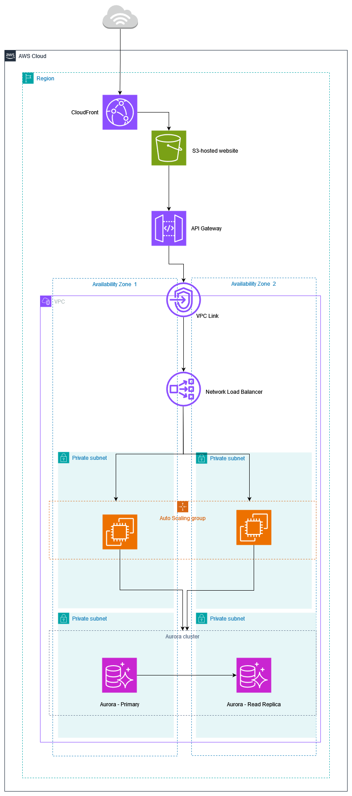

# AWS-Three-Tier Web Application CloudFormation Template

## Overview

This CloudFormation template deploys a scalable and resilient 3-tier web application architecture on Amazon Web Services (AWS). The architecture includes a frontend hosted on Amazon S3 and delivered via Amazon CloudFront for optimized content delivery, an application tier with EC2 instances managed by Auto Scaling, and a backend database tier powered by Amazon Aurora MySQL. The template automates the deployment of these resources, ensuring a well-architected setup that emphasizes security, performance efficiency, cost optimization, operational excellence, and reliability.

## Table of Contents

1. [Architecture Diagram](#architecture-diagram)
2. [Architecture Overview](#architecture-overview)
3. [Deployment Steps](#deployment-steps)
4. [Security](#security)
5. [Operational Excellence](#operational-excellence)
6. [Performance Efficiency](#performance-efficiency)
7. [Cost Optimization](#cost-optimization)
8. [Reliability](#reliability)

## Architecture Diagram



## Architecture Overview

The architecture consists of three tiers:

- **Frontend (Web Tier):**
  - Hosted on an S3 bucket.
  - Accessible via CloudFront for optimized content delivery.

- **Application Tier:**
  - EC2 instances managed by an Auto Scaling Group.
  - Instances are launched using a Launch Template with specified instance types and security groups.

- **Database Tier:**
  - Amazon Aurora MySQL cluster with a master instance and a read replica.
  - Secrets managed securely using AWS Secrets Manager.

## Deployment Steps

### Prerequisites

- AWS CLI installed and configured.
- AWS CloudFormation familiarity.

### Deployment Instructions

Use the AWS Management Console or AWS CLI to deploy the `template.yaml` included in this repository. Specify parameters as needed.

```bash
aws cloudformation deploy --template-file template.yaml --stack-name My3TierWebApp --parameter-overrides FrontEndBucketName=your-bucket-name
```

## Security

EC2 instances, Network Load Balancer and Aurora database instances are secured using AWS security groups to control inbound and outbound traffic. Data at rest in the Aurora cluster is encrypted using AWS-managed encryption keys. IAM policies are applied to restrict access and ensure that only authorized services and users can interact with the resources. An Amazon Machine Image (AMI) that supports AWS Systems Manager Session Manager is used for connecting to the EC2 instances, eliminating the need for SSH keys and thereby reducing the attack surface.

## Operational Excellence

The usage of AWS CloudFormation for IaC adheres to best practices by providing a repeatable and automated deployment process, ensuring consistency across deployments. Monitoring is provided through CloudWatch, which offers out-of-the-box metrics for services like EC2, NLB, and RDS, ensuring that critical metrics are captured without additional configuration.

## Performance Efficiency

EC2 instances are managed by Auto Scaling to automatically adjust capacity based on traffic patterns, and Amazon Aurora allows for automatic scaling to handle varying database workloads efficiently.

## Cost Optimization

Leveraging AWS services like EC2 Auto Scaling and Aurora database scaling ensures costs are optimized based on actual usage.

## Reliability

Multi-AZ deployment of Aurora ensures database availability in case of AZ failure, with the automatic fallback feature of Aurora.